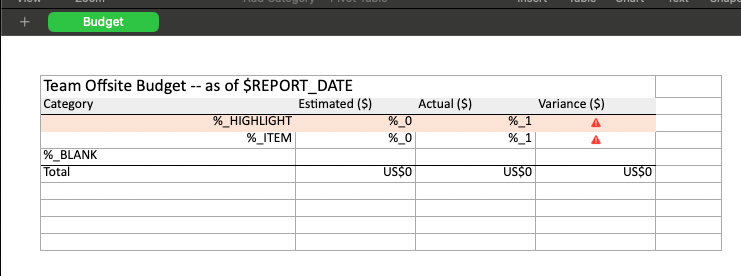
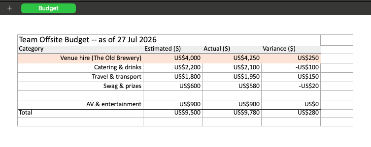
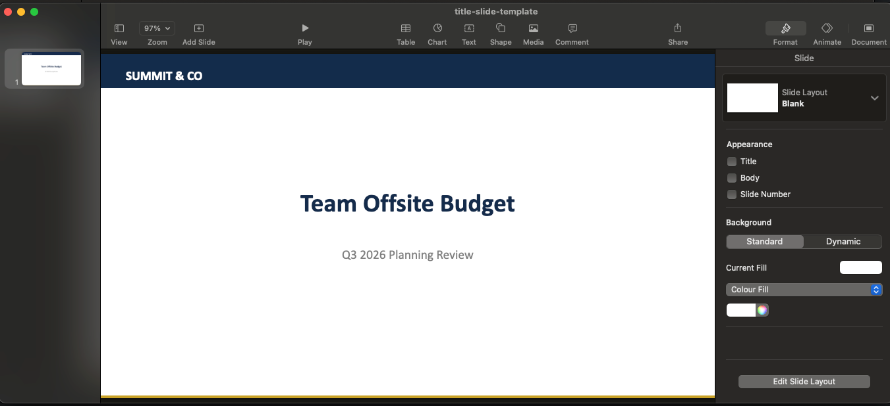
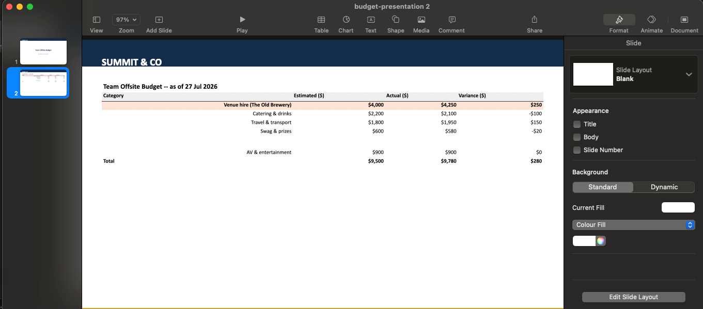

# xlsx-to-pptx

Converts one Excel sheet into a single PowerPoint slide, scaling font size,
column widths, and row heights uniformly so the whole sheet fits on one
slide. Preserves fill colors, borders, font styling, alignment, and merged
cells (including vertical merges spanning many rows).

Beyond converting a single fixed sheet, `SpreadsheetTemplate` renders a
variable number of data rows onto a hand-authored "row template" (marker
rows, per-row formulas, named-range totals that grow or shrink to fit), or
overwrites a fixed-size block of cells in place via `replaceRange`, and
`PptxMerger` stitches multiple slides -- e.g. a title slide and one or more
data slides -- into a single deck. The [tutorial](#tutorial-spreadsheet-template-to-branded-slideshow)
below walks through both, end to end.

## Setup

```
./gradlew build
```

Gradle will pull `org.apache.poi:poi-ooxml` and its transitive deps from
Maven Central on first run.

## Run (CLI)

```
./gradlew run --args="input.xlsx output.pptx"
```

Optional third arg selects a sheet by index (default 0):

```
./gradlew run --args="input.xlsx output.pptx 1"
```

The CLI (`Main`) only exposes `input.xlsx`, `output.pptx`, and an optional
sheet index. For every other option below, call `SpreadsheetToPptx.convert`
directly from Java.

## Use as a library

```java
byte[] pptxBytes;
try (var excelInput = new FileInputStream("input.xlsx")) {
    var params = ConvertParams.builder()
        .excelInput(excelInput)
        .sheetIndex(0)
        .title("Q3 Forecast")
        .scaleToFitWidth(true)
        .build();
    pptxBytes = new SpreadsheetToPptx().convert(params);
}
Files.write(Path.of("output.pptx"), pptxBytes);
```

`convert` takes a single `ConvertParams` (a Lombok `@Builder`) and returns
the generated `.pptx` as a `byte[]` -- it never touches the filesystem
itself, so opening the input and writing the output are the caller's
responsibility.

### `ConvertParams` options

| Option             | Type          | Default                | Description |
|---------------------|---------------|-------------------------|--------------|
| `excelInput`        | `InputStream` | *required*              | The `.xlsx` file to read. Read but never closed by `convert` -- opening and closing it is the caller's job. |
| `sheetIndex`         | `int`         | `0`                      | Which sheet in the workbook to convert. |
| `targetRange`        | `String`      | `null` (whole sheet)     | An Excel A1-notation range, e.g. `"B2:F10"`, restricting the conversion to that rectangle instead of the sheet's full used area. |
| `scaleToFitWidth`    | `boolean`     | `false`                  | Stretch column widths to fill the available width. Left off, a sheet narrower than the target area keeps its natural size and is centered horizontally instead. |
| `scaleToFitHeight`   | `boolean`     | `false`                  | Stretch row heights to fill the available height. Left off, a sheet shorter than the target area keeps its natural size. |
| `templateInput`      | `InputStream` | `null` (blank slide)     | A `.pptx` whose first slide is reused as the base for the output (e.g. one carrying a logo or other branding) instead of creating a blank presentation/slide. Like `excelInput`, read but never closed by `convert`. |
| `tableArea`          | `Rectangle2D` | `null` (default area)    | The exact rectangle (in points, relative to the slide's top-left corner) the table is laid out into, overriding the default margin-based area. Useful together with `templateInput` to fit the table around existing template content. |
| `title`              | `String`      | `null` (no title)        | Rendered as a bold title textbox at the top of the slide. Left unset, no title is added at all. |
| `linkUrl`            | `String`      | `null` (no link)         | Rendered as a small hyperlinked textbox in the slide's bottom margin -- e.g. a link to wherever the source spreadsheet can be downloaded. Left unset, no link is added at all. |
| `linkText`           | `String`      | `linkUrl` itself         | The link's visible, clickable label. Only used when `linkUrl` is also set. |

## Tutorial: spreadsheet template to branded slideshow

This walks through the whole pipeline with a small "team offsite budget"
example: a handful of expense line items, a SUM total that has to keep
working whatever number of items there are, rendered onto a branded slide,
and combined with a title slide into one deck.

Every file mentioned below is generated under `examples/` by
[`examples/src/main/java/xlsxtopptx/example/BudgetOffsiteExample.java`](examples/src/main/java/xlsxtopptx/example/BudgetOffsiteExample.java) --
run `./gradlew runExample` to (re)generate them yourself, or open the
already-generated copies directly:

```
template.xlsx (authored once) ---SpreadsheetTemplate.render(rows)---> rendered.xlsx
                                                                          |
                                                          SpreadsheetToPptx.convert
                                                     (templateInput = logo-template.pptx)
                                                                          |
                                                                          v
title-slide-template.pptx  +  data slide  ---PptxMerger.merge--->  budget-presentation.pptx
```

### 1. Design the row template (`examples/budget-template.xlsx`)

A row template is an ordinary `.xlsx` whose first sheet mixes static cells
(titles, headers) with a block of **marker rows** that `SpreadsheetTemplate`
clones once per data row at render time. The example's sheet looks like
this:

| Row | Contents |
|-----|----------|
| 1 | Merged title cell: `Team Offsite Budget -- as of $REPORT_DATE` |
| 2 | Header: `Category` \| `Estimated ($)` \| `Actual ($)` \| `Variance ($)` |
| 3 | Marker row `%_HIGHLIGHT`, bold + highlighted fill, for an over-budget item |
| 4 | Marker row `%_ITEM`, plain style, for an ordinary line item |
| 5 | Marker row `%_BLANK`, a spacer with no placeholders |
| 6 | `Total`, summing the marker block via named ranges |

A cell's text marks its role:

- **`%_<TYPE>`** in a row's label column (e.g. `%_HIGHLIGHT`) marks it as a
  marker row of that type -- `SpreadsheetTemplate` captures its styles,
  placeholders, and any formula before rendering anything. Marker rows must
  be contiguous (rows 3-5 here).
- **`%_0`, `%_1`, ...** mark the cells in a marker row that get filled in
  per data row, in order -- here `%_0` is Estimated and `%_1` is Actual.
- A marker row can carry its own formula (row 3's `Variance` cell is
  `=C3-B3`) -- when cloned to output row *N*, its cell references shift the
  same way Excel shifts a formula you drag-fill down.
- **`$TOKEN`** anywhere in a string cell (row 1's `$REPORT_DATE`) is a
  sheet-wide placeholder resolved once via `.placeholder(name, value)`,
  independent of how many data rows are rendered.
- The **named ranges** `COL_EST_VALUES` (`$B$3:$B$5`) and `COL_ACT_VALUES`
  (`$C$3:$C$5`) span exactly the marker block. Row 6's total formulas
  (`SUM(COL_EST_VALUES)`, `SUM(COL_ACT_VALUES)`) reference those names
  instead of a hardcoded range, so `render` can grow or shrink each range to
  cover however many rows actually get rendered and slide row 6 down (or
  up) to sit directly after them.



### 2. Render this month's data (`SpreadsheetTemplate`)

```java
var rows = List.of(
    SpreadsheetRow.type("HIGHLIGHT").data("Venue hire (The Old Brewery)", 4000, 4250).build(),
    SpreadsheetRow.type("ITEM").data("Catering & drinks", 2200, 2100).build(),
    SpreadsheetRow.type("ITEM").data("Travel & transport", 1800, 1950).build(),
    SpreadsheetRow.type("ITEM").data("Swag & prizes", 600, 580).build(),
    SpreadsheetRow.type("BLANK").build(),
    SpreadsheetRow.type("ITEM").data("AV & entertainment", 900, 900).build());

byte[] rendered;
try (var templateInput = new FileInputStream("examples/budget-template.xlsx")) {
    rendered = SpreadsheetTemplate.of(templateInput)
        .placeholder("REPORT_DATE", "27 Jul 2026")
        .render(rows);
}
Files.write(Path.of("examples/budget-rendered.xlsx"), rendered);
```

`type(...)` selects which marker row to clone; `.data(label, values...)`
fills the label cell and then the `%_0`, `%_1`, ... placeholders in order --
a type with no placeholders (`"BLANK"`) can skip `.data(...)` entirely. Add
a 7th line item next quarter, or drop to 3, and the total row's formulas
still add up correctly with no other changes.



The title now reads "as of 27 Jul 2026", six line items appear where the
template had three marker rows, and Total (now on row 9) still sums
correctly.

### Overwriting a fixed block (`replaceRange`)

Row-expansion isn't the only way to get data into a template. `replaceRange`
overwrites a **fixed-size** block of cells in place instead -- no growing or
shrinking -- for something like a small KPI grid that's always exactly the
same shape:

```java
rendered = SpreadsheetTemplate.of(templateInput)
    .replaceRange("Sheet1", "A1:B3", List.of(
        List.of("Revenue", 128000),
        List.of("Costs", 94000),
        List.of("Margin", 34000)))
    .render(rows); // or .render(List.of()) if there's no row-expansion to run
```

- `values` (row-major, one inner list per row) must exactly match the
  range's row/column count, or `render` throws.
- Existing cell styles are kept -- only the value changes. A cell that
  currently holds a formula is overwritten with a literal the same way
  typing over it in Excel would.
- It can target *any* sheet in the workbook, not just the one row-expansion
  runs on -- pass its name as the first argument.
- `render` applies every `replaceRange` before row-expansion, so a range
  sitting below the marker block (e.g. a footer note after the Total row) is
  carried along by the same row-shifting that moves the Total row itself,
  rather than needing its address computed for wherever the marker block
  ends up landing.
- A range overlapping the marker block itself is rejected -- that region
  belongs to row-expansion.
- `render` can be called with an empty row list as long as at least one
  `replaceRange` was registered, so it also works standalone on a sheet with
  no `%_` markers at all.

### 3. Convert to a branded slide (`SpreadsheetToPptx`)

`examples/logo-template.pptx` is a single branded slide (a navy masthead
reading "SUMMIT & CO" and a gold footer rule) with nothing else on it --
`ConvertParams.templateInput` reuses it as the base for the output slide
instead of a blank one, so the rendered table lands on top of the existing
branding:

```java
byte[] dataSlide;
try (var excelInput = new FileInputStream("examples/budget-rendered.xlsx");
     var templateInput = new FileInputStream("examples/logo-template.pptx")) {
    var params = ConvertParams.builder()
        .excelInput(excelInput)
        .templateInput(templateInput)
        .tableArea(new Rectangle2D.Double(40, 84, 880, 420)) // leaves room for the masthead
        .scaleToFitWidth(true)
        .build();
    dataSlide = new SpreadsheetToPptx().convert(params);
}
```

`tableArea` overrides the default margin-based placement so the table sits
below the masthead instead of overlapping it.

### 4. Build a matching title slide

`examples/title-slide-template.pptx` is a second single slide sharing the
same masthead and footer as `logo-template.pptx`, plus a centered title and
subtitle -- so once combined with the data slide, the deck reads as one
consistent presentation rather than two unrelated files. (If your brand
template already exists as one multi-slide company deck with a title
layout and a content layout, `PptxTemplates.loadFromResource(path,
slideIndex)` pulls either slide out as its own standalone single-slide
`.pptx`, ready to use the same way.)



`logo-template.pptx` shares the exact same masthead and footer, just
without the title/subtitle text -- that's the empty branded slide the data
table gets laid onto in the next step.

### 5. Merge into one deck (`PptxMerger`)

```java
try (var titleSlide = new FileInputStream("examples/title-slide-template.pptx");
     var dataSlideIn = new ByteArrayInputStream(dataSlide)) {
    var presentation = PptxMerger.merge(List.of(titleSlide, dataSlideIn));
    Files.write(Path.of("examples/budget-presentation.pptx"), presentation);
}
```

`PptxMerger.merge` concatenates each input's slides, in order, into one
presentation -- here, the title slide followed by the data slide.

The first slide is exactly `title-slide-template.pptx` above, copied over
unchanged. The second is the data slide from step 3, now sitting right
after it in the same deck:



## Testing

```
./gradlew test
```

## Test fixtures for downstream services

Services that call this library end-to-end -- generate a `.xlsx` or `.pptx`
and assert on the result -- run into the same problem: two files built from
identical inputs are never byte-identical. Timestamps in `core.xml`, calc
chain ordering, and other writer-run noise change every time, even though
the sheets, formulas, styling, and slides are indistinguishable to a human
opening either file. `xlsx-to-pptx-test-fixtures`, published from this
project's `testFixtures` source set, provides `SpreadsheetAssert` and
`SlideshowAssert` -- assertions that compare two files for *semantic*
equality instead, so a test can regenerate a file and compare it against a
stored expected copy without false failures.

Depend on it the way Gradle's `java-test-fixtures` plugin expects:

```groovy
testImplementation testFixtures(project(':xlsx-to-pptx')) // same build
// or, once published to a Maven repo:
testImplementation testFixtures('com.example:xlsx-to-pptx:1.0.0')
```

### `SpreadsheetAssert`

```java
SpreadsheetAssert.assertEquals(expectedXlsxBytes, actualXlsxBytes);
SpreadsheetAssert.assertEquals("budget export regression", expectedXlsxBytes, actualXlsxBytes);
```

Compares, sheet by sheet: sheet names, merged regions (including "center
across selection"), and every cell's text, formula, fill/font color,
bold/italic, font size and name, alignment, and borders. Two sheets of
different sizes are compared cell-by-cell up to the larger of the two
dimensions rather than throwing, so an extra row or column shows up as a
list of differences instead of an index-out-of-bounds error.

### `SlideshowAssert`

```java
SlideshowAssert.assertEquals(expectedPptxBytes, actualPptxBytes);
SlideshowAssert.assertEquals("slide deck regression", expectedPptxBytes, actualPptxBytes);
```

Compares, slide by slide: page size, background color, and each shape in
order -- position/size (within half a point), text and run styling
(bold/italic/size/color/hyperlink), table cell text/spans/fills/borders,
and picture bytes for images. Shapes are matched positionally and by exact
class, so a shape count or type mismatch is reported rather than causing a
misaligned comparison further down the slide.

### What both ignore, and what they report

Neither assertion looks at `core.xml` properties (created/modified
timestamps, revision), relationship id numbering, auto-generated shape
names, or XML attribute/element ordering -- exactly the noise that makes
two writer runs of "the same" file differ at the byte level. Regenerating a
file from the same inputs at a different time should always compare equal.

Both throw a plain `AssertionError` on failure (not a JUnit-specific
exception), so they work the same under JUnit, TestNG, or any other runner.
The message lists every difference found, e.g.:

```
spreadsheets are not semantically equal - 1 difference:
  - sheet[0] "Funding Requests": cell[row=5, col=0]: text: expected="Item One" actual="Item One (renamed)"
```

## Background

This started as a direct Java/Apache POI port of a Python prototype
(openpyxl + python-pptx) that validated the core algorithm -- real merges,
no text wrapping, uniform font-scale-to-fit, graceful degradation on a
large stress-test sheet -- by rendering to PNG via
`soffice --headless --convert-to png` and checking visually. The POI port
has since grown its own test suite (`./gradlew test`) covering layout,
merges, borders, and the CLI's argument handling.
